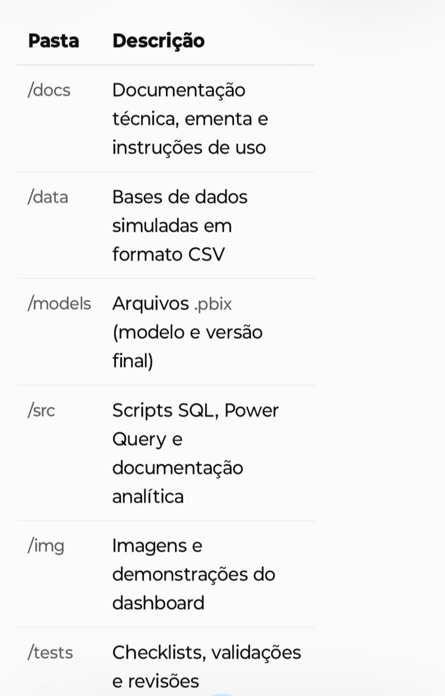
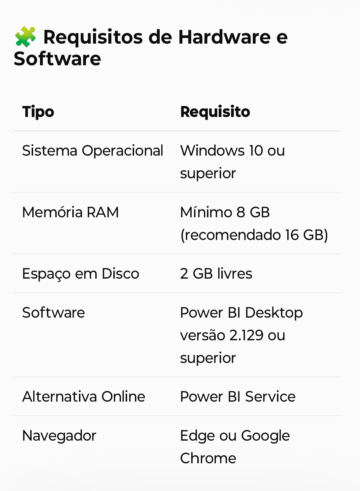

## Criando um Dashboard Gerencial para Tomada de Decisões Com Power BI.

---

## 📌 Contexto

Organizações produzem grandes volumes de dados financeiros e operacionais, porém nem sempre conseguem transformá-los em informação clara para apoiar decisões gerenciais. 

Relatórios excessivamente técnicos ou mal estruturados dificultam a leitura, aumentam o tempo de análise e reduzem o valor do dado.

Este projeto apresenta o desenvolvimento de um Dashboard Gerencial em Power BI, com foco em clareza analítica, organização visual e suporte à tomada de decisão, aplicando boas práticas de Business Intelligence, UX em dados e modelagem analítica.

---

## 🎯 Objetivo do Projeto

Construir um dashboard gerencial que permita:

• Visualizar indicadores-chave de desempenho (KPIs) de forma clara;

• Apoiar decisões estratégicas a partir de dados consolidados;

• Aplicar princípios de UX em BI para facilitar a leitura e navegação;

• Demonstrar domínio técnico em Power BI, DAX, modelagem e organização de dados.

O projeto foi inspirado no desafio do curso “Atualizando Relatório Financeiro com Foco na Experiência do Usuário”, sendo adaptado para um cenário profissional real.

---

## 🧠 Problema de Negócio

Gestores precisam responder perguntas como:

• Qual o desempenho de vendas por período, região ou produto?

• Quais indicadores exigem atenção imediata?

• Como comparar resultados de forma rápida e confiável?

Sem um dashboard bem estruturado, essas respostas dependem de análises manuais, múltiplas planilhas e maior risco de erro.

---

## ✅ Solução Proposta

Foi desenvolvido um Dashboard Gerencial interativo, que consolida dados financeiros e operacionais, oferecendo:

• KPIs organizados por prioridade visual;

• Navegação intuitiva entre páginas e visões analíticas;

• Matrizes detalhadas para análise exploratória;

• Layout orientado à leitura gerencial.

---

## 📊 Principais Indicadores (KPIs)

• Faturamento

• Margem

• Volume de Vendas

• Ticket Médio

• Análise temporal e comparativa

---

## 🧱 Estrutura do Repositório

  

 

---

## ⚙️ Tecnologias Utilizadas

• Power BI Desktop – Construção e visualização do dashboard

• DAX (Data Analysis Expressions) – Criação de medidas e KPIs

• Power Query (M Language) – Tratamento e transformação de dados

• SQL – Consulta e integração de dados

• Excel / CSV – Fontes de dados auxiliares

• Git/GitHub – Versionamento e organização do projeto

---

  

---

## 🚀 Como Executar o Projeto

✔️ **Com Power BI Desktop**

• 1. Clone o repositório:

git clone https://github.com/Santosdevbjj/dashboardGerencial

• 2. Abra o arquivo:

/models/dashboard_gerencial_final.pbix

• 3. Verifique as conexões com os arquivos da pasta /data.

• 4. Explore os relatórios e interações.

---

## ✔️ Sem Power BI Desktop

• Caso não possua o Power BI instalado, o projeto pode ser compreendido por meio de:

• Documentação técnica em /docs, explicando a modelagem e os cálculos;

• Imagens e capturas de tela em /img;

• Descrição das medidas DAX e transformações aplicadas.

---

## 🧠 Conceitos Aplicados

Business Intelligence aplicado ao contexto gerencial

• UX Design em relatórios analíticos

• Storytelling de dados

• Modelagem analítica

• Métricas e KPIs orientados a decisão

---

## 📘 Etapas do Desenvolvimento

• 1. Entendimento do problema

• 2. Modelagem dos dados

• 3. Tratamento e transformação (Power Query)

• 4. Criação de medidas e KPIs (DAX)

• 5. Construção dos visuais

• 6. Ajustes de layout e usabilidade

• 7. Validação final

---

## 🤝 Contribuições

Contribuições são bem-vindas:

• 1. Fork do repositório

• 2. Criação de branch (feature/minha-melhoria)

• 3. Commit das alterações

• 4. Pull Request

---

🧑‍💻 **Autor**

Sérgio Santos

---

📄 **Licença**

Este projeto está licenciado sob a MIT License.

---

**Contato:**

---

   
